### Lexical Analysis (词法分析)

词法分析指的是将输入的字符流，按照规则划分为词法单元并向下一阶段传递。

```c
int a = 10;
```

如在上面这一行代码中，按照C语言的词法划分规则可以划分为 **int**，**a**，**=**，**10**，**;** 这五个词法单元。

编译器在进行词法分析时，词法分析程序会依次进行:

正则表达式解读 -> 构造NFA(Thompson法) -> 构造DFA -> 最小化DFA


#### 1. 正则式 

正则式指的是对某类字符串定义的一组规则, 由符号和字母表组成，正则式中存在三种运算：**连接(ab)，闭包(a*)，选择(a|b)**，这三种运算的优先级为**闭包>连接>选择**。

```
a* -> ε|a|aa|aa...
(ab)* -> ε|ab|abab...
a*b -> b|ab|aab|aa...b
(a|b)* -> ε|a/b的任意组合

有时为了方便正则式的表达，往往会对某一类正则式进行命名
letter -> [a-zA-Z]	用来表示所有的大小写字母
number -> [0-9]		用来表示所有的数字
```


#### 2. NFA与DFA

在了解NFA与DFA前，应先了解**有限状态自动机**的定义。有限状态自动机是一种用图来表示某种算法的形式。有限状态自动机分为**非确定有限自动机(NFA)**和**确定有限状态自动机(DFA)**。如状态A接受输入a转换到状态B用有限状态机表示为：

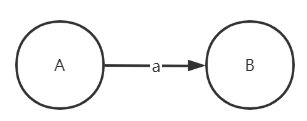

**NFA**指的是非确定有限状态自动机，其特点为在图中存在某一状态在接受同一种输入后，有多个不同的状态转换。如状态A接受输入a后转换为状态B、状态C。

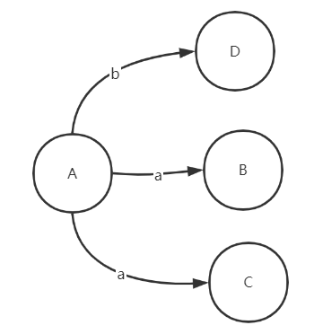

**DFA**指的是确定有限状态自动机，其特点为在图中对于某一状态下的一种输入，仅可对应唯一一个状态转换。如状态A接受输入a后仅可转换到状态B，不可以转换到状态C(也可以为仅可转换到状态C，不可以转换到状态B)。

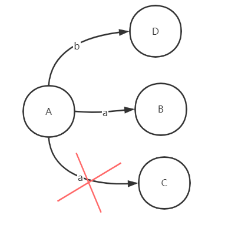


#### 3. 正则式->NFA

从正则式向NFA转换常用**Thompson法**进行转换，在转换中三种运算对应的状态图分别为：

**连接：ab**，图中也可以省略ε这一步转换，直接由2接受输入b到4。

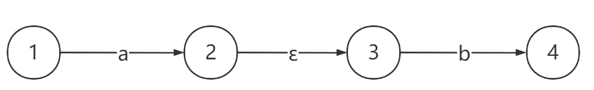

**选择：a|b**

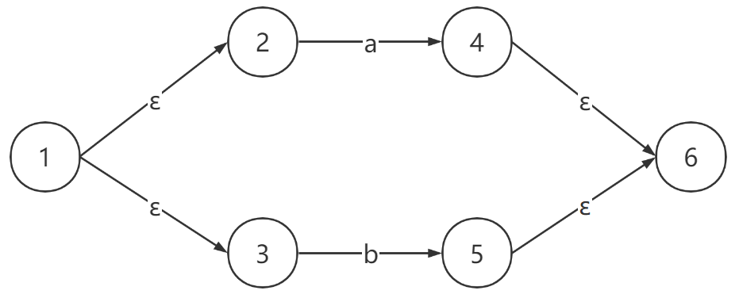

**闭包：a***

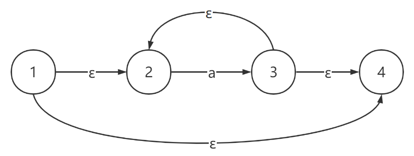


**举例**：以正则式： **a|ab***  举例，首先根据算符优先级应先进行 b 的闭包运算（图1），然后进行a与b闭包的连接运算（图2），最后进行选择运算（图3），在绘画图3时，由于该图为该正则式的最终图因此要在状态0前置begin箭头，状态8要画为双同心圆形以示状态8为最终状态。

图1：
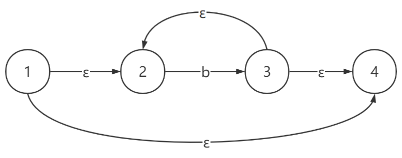

图2：
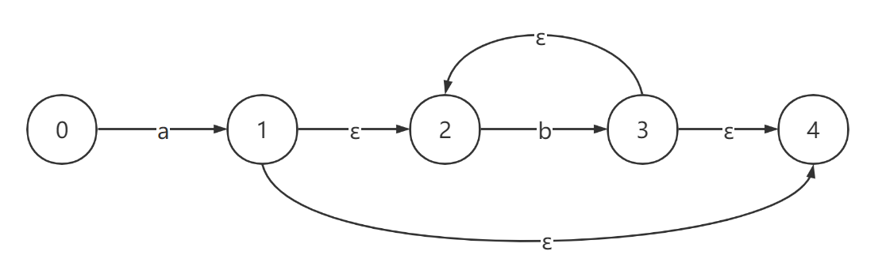

图3：
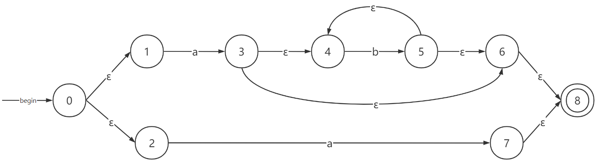


#### 4. NFA->DFA

在将正则式转化为NFA后，接下来的步骤为使用**最小闭包法**将NFA转化为DFA，即让状态之间的转化变为唯一确定的形式。在NFA转化为DFA过程中需要用到 **ε-closure(T)、move[T, token]、Dtran[T, token]** 这几个概念，下文将通过举例方式逐一介绍。

图4：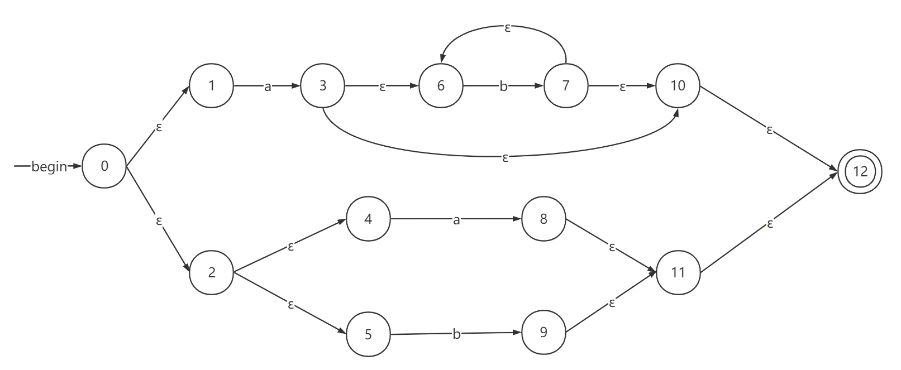

**ε-closure(T)**：指的是T集合的最小闭包，其定义为从集合T中的每一个状态开始，走零个或多个ε边能到达的所有状态的集合。

eg: 如**图4**中的NFA所示，假设T={0，1}，求ε-closure(T)

答：从状态0开始走0个ε边可以到达状态0，走1个ε边可以到达状态1和2.走两个ε边可以到达的状态为4和5，从状态1走0个ε边可以到达状态1。因此 ε-closure(T) = {0，1，2，4，5}


**move[T, token]**：指的是T集合的move包，其定义为从集合T中的每一个状态开始，走一个token后能到达的状态，在未走到token边之前，可以走任意个ε边。

eg:如**图4**中NFA所示，假设T={0，1}，求move[T, a]

答：从状态0开始，走一个ε边和一个a边后到达状态3，因此3在move[T, a]中；从状态0开始，走两个ε边和一个a边后到达状态8；从状态1开始，走零个ε边和一个a边后到达状态3。因此move[T, a] = {3 , 8}


**Dtran[T, token]**: 指的是move[T, token]的ε-closure，即Dtran[T, token] = ε-closure(move[T, token])。

eg:如**图4**中NFA所示，假设T={0，1}，求Dtran[T, a]

答：从状态0开始，走一个ε边和一个a边后到达状态3，因此3在move[T, a]中；从状态0开始，走两个ε边和一个a边后到达状态8；从状态1开始，走零个ε边和一个a边后到达状态3。因此move[T, a] = {3 , 8}。从move[T,a] = {3, 8}中的状态3出发，走0个ε边可以到达状态3，走1个ε边可以到达状态6和状态10，走2个ε边可以到达状态12。同理从状态8出发，可达为状态8，11，12。因此Dtran[T, a] = {3，8，6，10，12，11}


在了解这三个概念后，我们还需要建立一个表来记录每一个状态对应的Dtran[T, token]。在表中主要记录每次起始的T(除第一行T为初始状态外，其余行的T为该行上面行中Dtran[T, a]和Dtran[T,b]中从未在T中出现过的集合)。针对**图4**建表如下：

| T                             | Dtran[T, a]                   | Dtran[T, b]        |
| ----------------------------- | ----------------------------- | ------------------ |
| {0}                           | {**3**，**8**，6，10，12，11} | {**9**，11，12}    |
| {**3**，**8**，6，10，11，12} | Ø                             | {**7**，6，10，12} |
| {**9**，11，12}               | Ø                             | Ø                  |
| {**7**，6，10，12}            | Ø                             | {**7**，6，10，12} |

在建表后，对表格中所有表格单元中相同的集合标记为同一状态，若该集合中包含NFA中的最终状态则在DFA中该状态也为最终状态。

状态合并后的表为：

| T             | Dtran[T, a]   | Dtran[T, b]   |
| ------------- | ------------- | ------------- |
| 状态0         | 状态1（终态） | 状态2（终态） |
| 状态1（终态） | Ø             | 状态3（终态） |
| 状态2（终态） | Ø             | Ø             |
| 状态3（终态） | Ø             | 状态3（终态） |

**DFA为**：

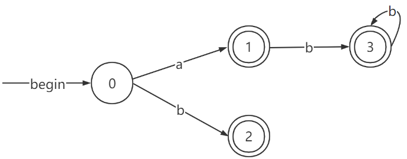


#### 5. DFA->minDFA

在得到DFA后，为了简化程序的复杂度，通常使用化简后的DFA（minDFA）作为最终的分析。从DFA到minDFA需要经过以下几个步骤：

1.将DFA中的状态划分非终态集合N, 和终态集合T

2.分别求N和T中的move[N, token]和move[T, token]，判断N中的各个状态是否等价，T中的各个状态是否等价。等价的判断标准为：move[N, token]和move[T, token]是否为当前划分集合中的真子集，若是则等价，否则不等价则继续将该集合划分为A, B两个集合，重复步骤2，直到每个集合中的状态都等价。

以**4节中的DFA为例**：非终态集N={0}， 终态集T={1，2，3}。由于N中仅为0一个状态，故不可再划分。对于T中，发现move[T, a]={Ø}∈{N,T}，move[T, b]={3}∈{N, T}，因此T中的状态1，2，3等价。

故**化简后的DFA(minDFA)**为：

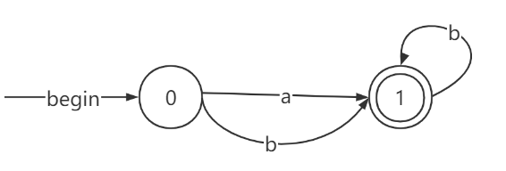


#### 6. Lex程序书写

在实际操作中，我们往往借用lex/flex程序来进行词法分析过程。

lex/flex程序格式如下：

```c
%{定义: definition%}
%%
规则: rules
%%
用户代码：code
```

举例：

```c
%{
    //引入的C语言头文件，在生成的词法分析文件中直接引用
	#include<stdio.h>
	#include<stdlib.h>
%}
DIGIT [0-9]
%%

//自定义的正则式及对应的输出动作
{DIGIT} {printf("<num, %s>\n", yytext);}

%%
int main(){
    /*code*/
	yylex();
	return 0;
}
int yywrap(){
	return 1;
}
```

